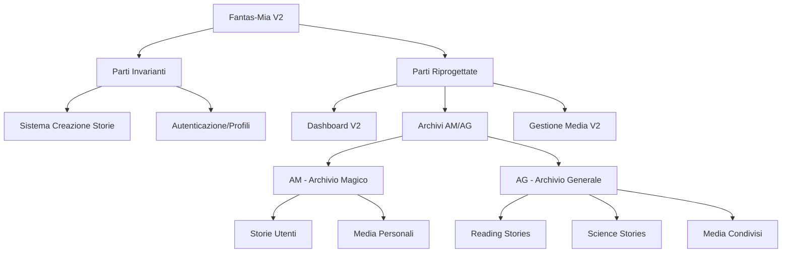

# Fantas-Mia V2 - Architettura del Sistema

## Overview Architetturale

### Principi Fondamentali
1. **Separazione delle Responsabilità**: Parti invarianti vs riprogettate
2. **Archivi Separati**: AM (Archivio Magico) vs AG (Archivio Generale)
3. **Design System Semantico**: Token HSL centralizzati
4. **Storage Persistente**: IndexedDB per media e dati utente

## Architettura Dati

### Struttura Archivi



### AM (Archivio Magico) - Storie Utenti
```typescript
interface ArchivioMagico {
  tipo: 'AM';
  accesso: '/user-archive';
  contenuto: {
    storieUtente: UserStory[];
    mediaPersonali: MediaFile[];
    impostazioni: UserSettings;
  };
  permessi: {
    lettura: 'solo_proprietario';
    scrittura: 'solo_proprietario';
    eliminazione: 'solo_proprietario';
  };
}
```

### AG (Archivio Generale) - Storie Superuser
```typescript
interface ArchivioGenerale {
  tipo: 'AG';
  accesso: ['/reading-stories', '/science-stories'];
  contenuto: {
    readingStories: SuperuserStory[];
    scienceStories: SuperuserStory[];
    mediaCondivisi: SharedMediaFile[];
  };
  permessi: {
    lettura: 'tutti_utenti';
    scrittura: 'solo_superuser';
    eliminazione: 'solo_superuser';
  };
}
```

## Architettura Componenti

### Layout e Navigazione
```
src/components/shared/
├── StoryLayout.tsx          // Layout unificato V2
├── ProfileIndicator.tsx     // Nome utente drag-and-drop
├── NavigationBar.tsx        // Barra superiore unificata
└── HomeButton.tsx           // Pulsante Home standardizzato
```

### Gestione Media V2
```
src/components/media/
├── MediaManager.tsx         // Gestore media centrale
├── ImageGenerator.tsx       // AI senza testo
├── MediaViewer.tsx         // Overlay viewer
├── MediaIndicator.tsx      // Indicatori verde/rosso
└── MediaStorage.tsx        // IndexedDB storage
```

### Archivi Separati
```
src/components/archives/
├── AM/
│   ├── UserArchive.tsx     // Archivio Magico
│   ├── UserStoryCard.tsx   // Card storie utenti
│   └── UserMediaGrid.tsx   // Grid media personali
└── AG/
    ├── GeneralArchive.tsx  // Archivio Generale
    ├── ReadingStories.tsx  // Storie lettura
    ├── ScienceStories.tsx  // Storie scientifiche
    └── SharedMediaGrid.tsx // Grid media condivisi
```

## Design System V2

### Token Semantici (HSL)
```css
/* src/index.css */
:root {
  /* Archivio Magico (AM) */
  --am-primary: 280 100% 70%;     /* Viola magico */
  --am-secondary: 290 60% 85%;    /* Viola chiaro */
  --am-accent: 270 80% 60%;       /* Accento magico */
  
  /* Archivio Generale (AG) */
  --ag-primary: 210 100% 56%;     /* Blu generale */
  --ag-secondary: 220 60% 85%;    /* Blu chiaro */
  --ag-accent: 200 80% 60%;       /* Accento generale */
  
  /* UI Globale */
  --ui-success: 120 100% 40%;     /* Verde successo */
  --ui-error: 0 100% 60%;         /* Rosso errore */
  --ui-warning: 45 100% 60%;      /* Giallo warning */
  --ui-info: 200 100% 60%;        /* Blu info */
}
```

### Componenti Stilizzati
```typescript
// Esempio Button variants per archivi
const buttonVariants = cva("base-button-styles", {
  variants: {
    archive: {
      am: "bg-am-primary text-white hover:bg-am-accent",
      ag: "bg-ag-primary text-white hover:bg-ag-accent",
      neutral: "bg-muted text-foreground hover:bg-muted/80"
    }
  }
});
```

## Storage e Persistenza

### IndexedDB Schema
```typescript
interface StorageSchema {
  // Media persistenti
  media: {
    id: string;
    storyId: string;
    type: 'image' | 'audio' | 'video';
    data: Blob;
    metadata: MediaMetadata;
    archive: 'AM' | 'AG';
    createdAt: Date;
  };
  
  // Posizione UI persistente
  ui_positions: {
    component: string;
    position: { x: number; y: number };
    userId: string;
  };
  
  // Cache storie
  stories_cache: {
    id: string;
    data: Story;
    archive: 'AM' | 'AG';
    lastAccessed: Date;
  };
}
```

## Sicurezza e Accesso

### Matrice Permessi
| Risorsa | Utente Standard | Superuser | Guest |
|---------|----------------|-----------|--------|
| AM Storie | RW (proprie) | - | - |
| AM Media | RW (propri) | - | - |
| AG Reading | R | RWD | R |
| AG Science | R | RWD | R |
| AG Media | R | RWD | R |
| Dashboard | R | RW | - |

### Validazione Accessi
```typescript
class ArchiveSecurityManager {
  validateAMAccess(userId: string, storyId: string): boolean {
    // Solo il proprietario può accedere alle proprie storie AM
    return this.isOwner(userId, storyId);
  }
  
  validateAGAccess(userId: string, action: 'read' | 'write' | 'delete'): boolean {
    if (action === 'read') return true; // Tutti possono leggere AG
    return this.isSuperuser(userId); // Solo SU può scrivere/eliminare
  }
}
```

## Performance

### Ottimizzazioni
1. **Lazy Loading**: Componenti caricati on-demand
2. **Virtual Scrolling**: Per liste lunghe di storie
3. **Image Caching**: Cache intelligente per media
4. **IndexedDB**: Storage locale per performance
5. **Component Memoization**: React.memo per componenti pesanti

### Metrics da Monitorare
- Tempo caricamento archivi
- Dimensione cache IndexedDB  
- Performance rendering liste
- Velocità generazione media

## Testing Strategy

### Test Suites
1. **Invariant Tests**: Verificare che parti non modificate funzionino
2. **Archive Separation Tests**: Validare separazione AM/AG
3. **UI/UX Tests**: Confermare standard V2
4. **Storage Tests**: Testare IndexedDB operations
5. **Security Tests**: Validare matrice permessi

### Test Data
```typescript
// Mock data per testing
const mockAMStory: UserStory = {
  id: 'am-story-1',
  title: 'La mia storia magica',
  content: '...',
  archive: 'AM',
  owner: 'user-123'
};

const mockAGStory: SuperuserStory = {
  id: 'ag-story-1', 
  title: 'Storia condivisa',
  content: '...',
  archive: 'AG',
  category: 'reading',
  author: 'superuser-456'
};
```

## Deployment

### Build Process
1. **Invariant Verification**: Check che parti invarianti non siano modificate
2. **Archive Validation**: Verifica separazione AM/AG
3. **Asset Optimization**: Ottimizza media e assets
4. **Bundle Analysis**: Analizza dimensioni bundle
5. **Performance Testing**: Test performance pre-deploy

### Rollback Strategy
- Parti invarianti garantiscono funzionalità core
- Database migration reversibili
- Asset versioning per rollback media
- Feature flags per nuove funzionalità V2